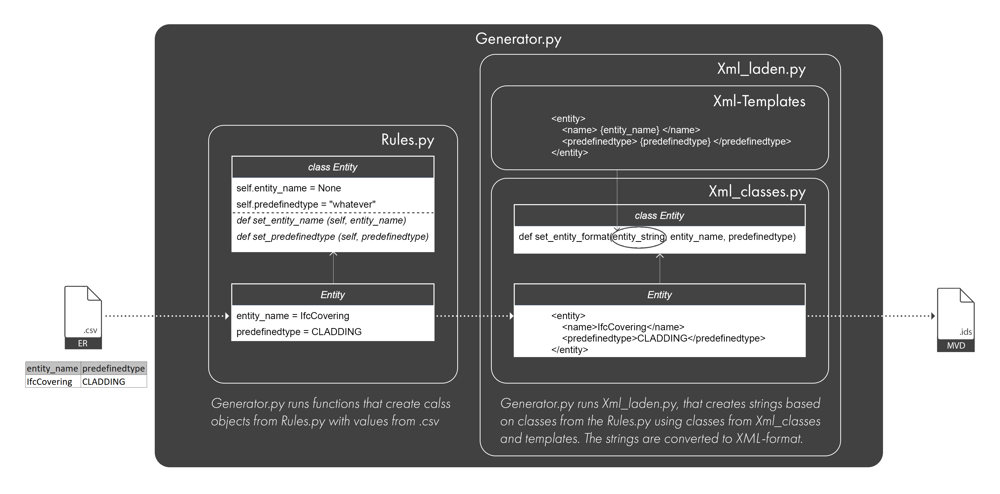

# IdS-Generator

## Project description 

IdS Generator is an adaptation of the RWTH Generator to create a Model View Definition in the form of IdS (XML-file) from information in Excel tables (.csv). The project is under development. IdS V0.4.

## Project structure

The interface is not currently written in the project. The project consists of: 
* rules.py
* xml.py
* xml_laden.py
* generate.py

## Instructions

In the tabular form (.csv), you first need to enter information about which IFC-Elements will be checked (this data starts with ap_-applicability), then there is information about the properties, classification, material that will be checked. The values can specify the length of the value (e.g.: length: 2), the values to choose (e.g.: enumeration: 30, 60, 90), the boundaries of the value (e.g.: min: 0, max: 120) or the pattern (e.g.: pattern: [a-z]). You need to run the file generator.py. As a result, a folder with IdS-files will be created.

## Applied technology

Libraries:
* pathlib
* csv
* os
* datetime
* xml

### Links: 
[Information about the IdS format](https://github.com/buildingSMART/IDS/tree/master/Development)

[The RWTH Generator for mvdXML](https://github.com/Design-Computation-RWTH/ILC_Demonstrator)
